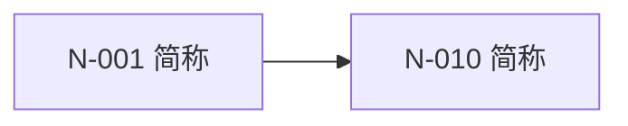
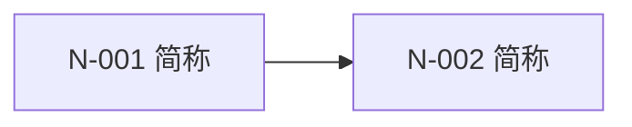

# `LEARNER-STATE.md` 规范

`LEARNER-STATE.md` 位于学习工作区根目录，是认知图谱与节点学习状态的唯一状态事实来源。不得另建使命、进度、问题、学习记录或中断恢复文件。

## 标识与版本

- 节点 ID：`N-001` 起三位递增。ID 一经分配永不复用；节点改名不改 ID。
- 知识簇 ID：`C-01` 起两位递增。
- 结构版本：`G-0001` 起四位递增。每次结构提交加一；纯教学状态更新不变。
- 课程序号：`S-YYYYMMDD-NN`，同日从 `01` 递增。
- 事件 ID：`E-YYYYMMDD-NN`，同日从 `01` 递增。
- 日期使用 `YYYY-MM-DD`。没有复测日历要求时，复测“触发”优先写事件条件，不虚构日期。

## 标准模板

````md
# 学习状态：{主题}

## 使命契约

- 现实目标：{现实中要发生的可观察变化}
- 最终验证任务：{整合多个关键节点的新任务}
- 范围：{当前包含的范围}
- 约束：{时间、预算、工具等}
- 范围外：{明确排除的邻近主题}
- 最终目标节点：N-...

## 图谱元数据

- 结构版本：G-0001
- 结构更新日期：YYYY-MM-DD
- 最终目标节点：N-...
- 阶段目标节点：[N-..., N-...]
- 知识簇：[C-01 名称, C-02 名称]

## 图谱视图（派生）

> 本节由“当前节点清单”重建；节点清单是唯一结构事实来源。

### 总览



### C-01：{知识簇名}



## 当前节点清单（结构事实来源）

### N-001｜{可验证的节点短名}

- 陈述：用户能够解释{因果机制}，并用它处理{一类新问题}。
- 知识簇：C-01
- 类型：关键
- 前置节点：[]
- 稳定掌握判据：
  - {开放解释必须包含的机制要点}
  - {必须建立的前置连接}
  - {变化条件下的正确推理}
  - {迁移任务的成功表现}
- 关键来源：[R-001]
- 适用条件与争议：无
- 掌握状态：未掌握
- 证据摘要：
  - 尚未验证
- 当前稳定误解：无
- 复测信息：
  - 最近复测：无
  - 下次触发：{完成 C-01 后／进入 N-010 前／长期中断恢复时}
  - 原因：{为什么需要复测}
- 笔记链接：[]
- HTML 链接：[]
- 链接材料复核：无

## 退役 ID 映射

- 无
<!-- 有退役节点时：N-004 → [N-011, N-012]；自 G-0003 起；原因：节点拆分 -->

## 精简事件记录

### E-YYYYMMDD-01

- 类型：结构变化 | 掌握状态变化 | 复测失败 | 重要误解
- 课程序号：S-YYYYMMDD-NN | 无
- 影响节点：[N-...]
- 结构版本：G-0001
- 摘要：{足以支持以后判断的压缩记录}
````

## 字段规则

- “陈述”必须是生成性认识，不能写成“了解 X”“完成第 3 章”或一个活动。
- “前置节点”只列必要认知前置。空列表表示根节点。
- “稳定掌握判据”在建图时确定；教学 Skill 只能按它验证，不能改写。
- “掌握状态”只有“未掌握”和“已掌握”。不得写“学习中”、百分比或模糊等级。
- 尚未诊断的节点仍为“未掌握”，证据固定写“尚未验证”。
- 节点只有在全部必要前置为“已掌握”且自身判据全部满足时，才能标记“已掌握”。
- 每条证据只保留课程序号或日期、验证类型、关键推理、结论和仍需注意的问题；不保存完整回答或完整题目。
- “当前稳定误解”只保留仍会影响后续判断的误解；已解决且不再重要的内容移入事件摘要或删除。
- `notes/<节点ID>.md` 仅保存图谱字段装不下的长期价值内容。HTML 必须位于 `assets/` 且经过实际渲染和交互测试。
- “链接材料复核”只能是“无”或“待复核：{原因}”。
- 当前节点清单只含有效节点；删除节点只出现在退役映射与事件中。

## Mermaid 重建规则

- 总览只画关键节点、知识簇和阶段目标；局部图可以加入辅助节点。
- 图中节点和边必须逐项来自当前节点清单。前置 `A` 到节点 `B` 的边写作 `A --> B`。
- Mermaid 中使用去掉连字符的内部别名（如 `N001`），显示标签保留正式 ID。
- 修改节点清单后必须重建受影响视图；不得只改图不改清单。

## 事件压缩

定期合并重复证据和重复误解，删除不再影响判断的普通事件。必须保留结构变化、掌握状态变化、复测失败和反复出现的重要误解。压缩不得改变当前节点状态，也不得抹去退役 ID 替代关系。
